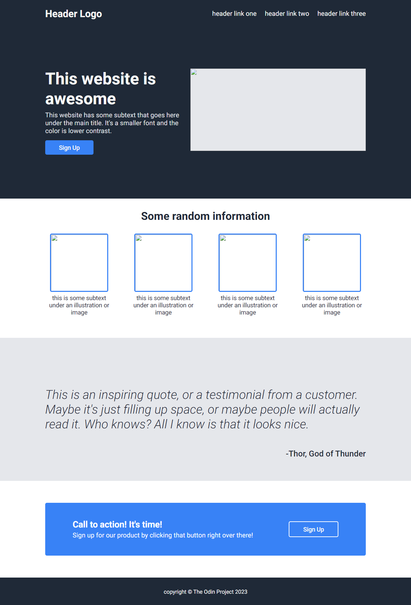

# odin_landing
The second exercise from odin curriculum

# Final layout is [here](https://mariante0dorescu.github.io/odin-landing/)

# Thoughts
My #1 goal was to make is visually equal as the image provided in the exercise files.
For this exercise I used the flexbox layout for most of his sections, I don't know how well the CSS file is written, I have a lot of questions regarding the semantic structure, but for now I think is enough :). I didn't include any images, mostly because of copyright issues, but the placeholders are in place.

# Screenshot

